# D1 Jetson Orin USB-CANFD Deployment README


[](https://github.com/NavBotHub/D1_rl_sar#)

[中文版本](README_CN.md)

> This D1 real-robot deployment guide is validated for Jetson Orin Nano Super, JetPack 6.2.2, Ubuntu 22.04, ROS 2 Humble, and DaMiao USB-CANFD.

This document describes the real-robot deployment flow for D1 on Jetson Orin Nano Super, JetPack 6.2.2, Ubuntu 22.04, and ROS 2 Humble. The CAN bus uses a DaMiao `DM-USB2CANFD_Dual` dual-channel USB-CAN FD adapter, the IMU is `DM-IMU-L1`, and the leg motors are DaMiao `DM6248P`.

## Table of Contents

- [1. Scope and Requirements](#1-scope-and-requirements)
- [2. Flash JetPack 6.2.2](#2-flash-jetpack-622)
- [3. First Boot, Network, and APT Sources](#3-first-boot-network-and-apt-sources)
- [4. Repository Setup and Build](#4-repository-setup-and-build)
- [5. USB-CANFD and gs_usb Driver](#5-usb-canfd-and-gs_usb-driver)
- [6. Real Motor Parameters and Zero Calibration](#6-real-motor-parameters-and-zero-calibration)
- [7. Real-Robot Runtime and Controls](#7-real-robot-runtime-and-controls)
- [8. Optional MuJoCo Simulation](#8-optional-mujoco-simulation)
- [9. Short Startup Checklist](#9-short-startup-checklist)
- [10. FAQ](#10-faq)
- [References](#references)

## 1. Scope and Requirements

### Verified Status

| Status | Item |
|---|---|
| Verified | ROS 2 Humble workspace builds successfully |
| Verified | `d1_description` has a valid ROS2 `package.xml` |
| Verified | `rl_sar` builds the real-robot executables `rl_real_d1` and `rl_real_d1_trigger` |
| Verified | `dm_imu_node` publishes `/imu/data` |
| Verified | After flashing SocketCAN firmware, `DM-USB2CANFD_Dual` enumerates as `can1` / `can2` |
| Verified | `5.15/gs_usb.ko` works for CAN FD on the Jetson 5.15 kernel |
| Verified | `d1-gs-usb.service`, `d1-canfd@.service`, and udev rules auto-load and configure CAN FD |
| Verified | `rl_real_d1` starts, FSM transitions work, and the ONNX policy loads |
| Needs safe robot validation | Full CAN communication with real motors connected |
| Needs safe robot validation | Suspended-robot stand-up, sit-down, and locomotion tests |

### Hardware and System Requirements

| Item | Requirement |
|---|---|
| Board | Jetson Orin Nano Super |
| JetPack | JetPack 6.2.2 |
| Jetson Linux | Jetson Linux 36.5 |
| OS | Ubuntu 22.04 rootfs |
| Kernel | Jetson 5.15.x |
| ROS | ROS 2 Humble |
| Robot | D1 |
| IMU | DM-IMU-L1 |
| CAN | DM-USB2CANFD_Dual |
| Motors | DM6248P |
| Inference | ONNX Runtime, CPU first |

If your kernel is not 5.15.x, rebuild and re-check `5.15/gs_usb.ko`. If your CAN adapter is not `DM-USB2CANFD_Dual`, do not copy the CAN setup blindly.

## 2. Flash JetPack 6.2.2

### 2.1 Enter Recovery Mode

When flashing Jetson Orin Nano Super for the first time, enter Recovery mode before powering the board. Do not reverse the order:

1. Keep the board powered off.
2. Hold the `Recovery` button on the right side of the carrier board.
3. While holding `Recovery`, power on the board.
4. Release `Recovery` after power-on, then continue the flashing flow from the host machine.

The image below marks the `Recovery` button used for flashing mode:

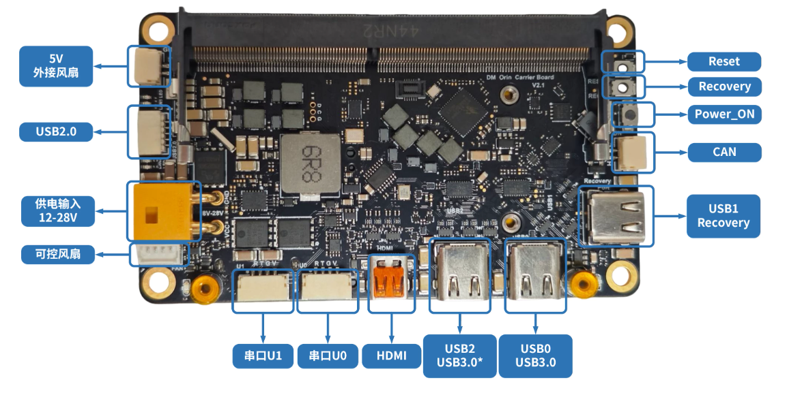

Note: Recovery mode is only needed for flashing. For normal robot operation, power on directly without holding `Recovery`.

### 2.2 Download and Open SDK Manager

Download and install NVIDIA SDK Manager from the official site:

<https://developer.nvidia.com/sdk-manager>

SDK Manager downloads JetPack, flashes Jetson Linux, and then installs CUDA, runtimes, and optional SDK components after the base image is written.

Windows host note: NVIDIA documentation states that starting from JetPack 6.2.1, flashing supported Jetson devices from Windows uses WSL2 and USBIPD for USB handling. If SDK Manager's automatic USB handling fails, use the USBIPD troubleshooting commands below.

### 2.3 STEP 01: Select Jetson and JetPack 6.2.2

After SDK Manager detects Jetson Orin Nano, choose:

- Product Category: `Jetson`
- Target Hardware: the detected `Jetson Orin Nano`
- SDK Version: `JetPack 6.2.2`

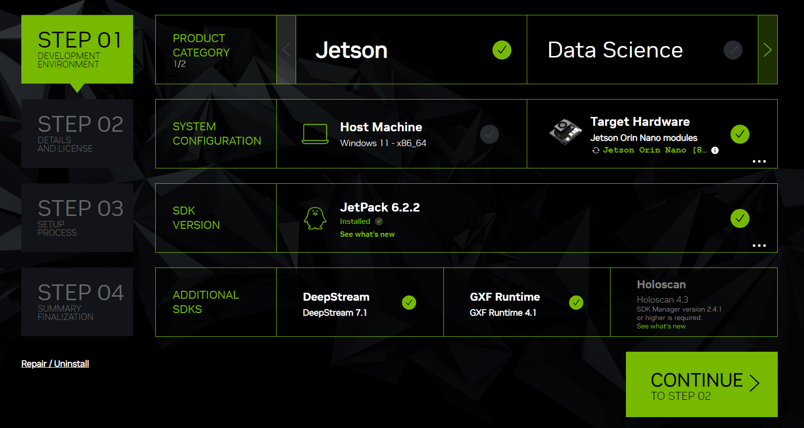

### 2.4 STEP 02: Select Components

In STEP 02, `Jetson Linux` must be selected. It contains the target OS image and the flash flow. Other runtime / SDK components can be selected as needed; if disk space is sufficient, selecting all components is usually fine.

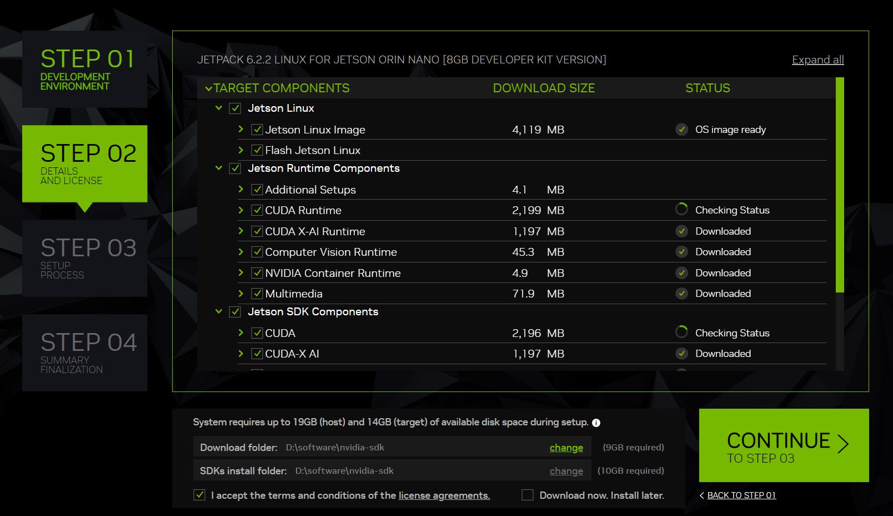

### 2.5 Pre-Config and NVMe Before Flash

Before flashing starts, SDK Manager shows a flash configuration dialog:

- Set `OEM Configuration` to `Pre-Config`.
- Fill in your own `New Username` and `New Password`.
- Set `Storage Device` to `NVMe`.
- Click `Flash` after confirming the settings.

Note: flashing can occasionally fail. In most cases, power-cycling the Jetson, entering Recovery mode again, and flashing again solves it.

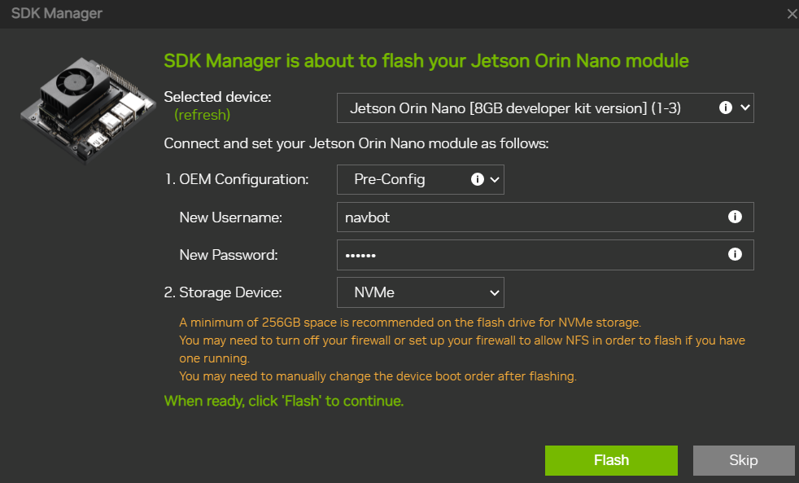

### 2.6 Install SDK Components

At around 25% progress, the Jetson Orin Nano system image is usually already written, and the board can boot. At this point only the base image is complete; SDK Manager will continue installing the SDK components selected earlier.

When the SDK components install dialog appears, make sure the board has reached the Ubuntu login screen, then fill in the connection information:

- `Connection`: usually keep the default `USB`.
- `IP Address`: the static IP of the USB virtual network interface, usually `192.168.55.1`; normally leave it unchanged.
- `Username` and `Password`: use the board username and password configured in `Pre-Config`.
- Click `Install` to continue installing SDK components.

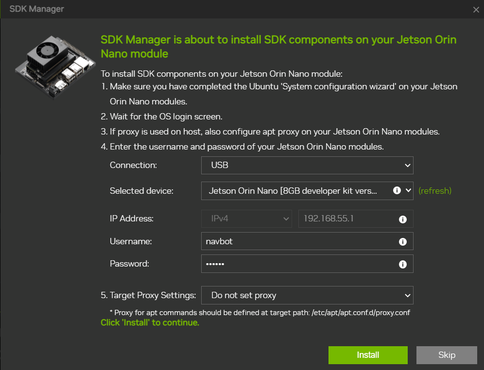

When `INSTALLATION COMPLETED SUCCESSFULLY` appears, flashing and SDK component installation are complete. Click `FINISH` to exit.


### 2.7 USBIPD Troubleshooting

If USB connection or device detection fails during flashing, try rebinding and attaching the Jetson USB device to WSL from **Administrator PowerShell**:

```powershell
usbipd list
usbipd bind --busid 1-3 --force
usbipd attach --wsl --busid 1-3
```

If your `usbipd` version supports auto attach, you can also try:

```powershell
usbipd attach --wsl --busid 1-3 --auto-attach
```

If it is not supported, keep using normal `attach`.

> Note: `1-3` is only an example. Use the actual BUSID shown by your own `usbipd list`.

## 3. First Boot, Network, and APT Sources

### 3.1 Wired Network and IP Address

After flashing, Jetson Orin Nano may temporarily have no WiFi. This is usually caused by missing wireless NIC kernel driver components in JetPack 6.2.2. The fix requires installing packages from APT, so the board first needs network access.

If the board has no network, the simplest method is to plug in Ethernet. If the router is nearby, connect an Ethernet cable directly to the Jetson Orin Nano network port.

The image below marks the carrier board Ethernet ports and WiFi M.2 2230 location:

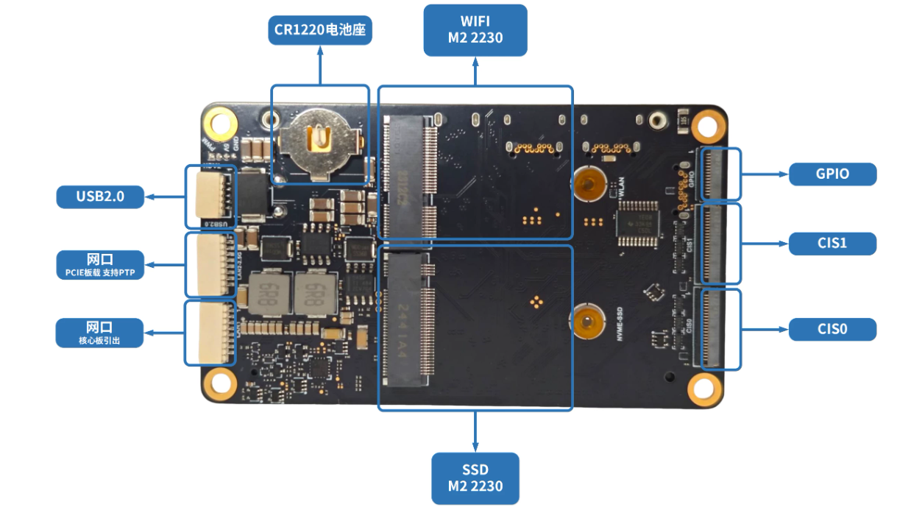

After getting the board IP address, connect remotely from a terminal. You can find the IP address in these ways:

- Check the router DHCP device list.
- Connect a display, mouse, and keyboard to Jetson and check the network IP in the system.
- Run `ip addr` on Jetson and check the wired interface address.

SSH example:

```bash
ssh <username>@<board-ip>
```

### 3.2 Change APT Source and Add ROS2 Source

After network access is available, first use FishROS' one-click tool to change the system source and improve APT download speed:

```bash
wget http://fishros.com/install -O fishros && . fishros
```

In the menu, enter `5` to select the system source tool.

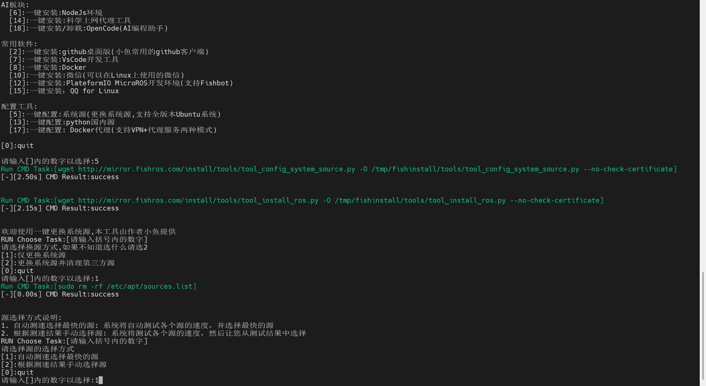

The source tool then shows two options:

- `[1]`: change only the system source.
- `[2]`: change system source and clean third-party sources.

**Choose `[1]`; do not choose `[2]`.** Jetson systems include NVIDIA / JetPack third-party APT sources. Cleaning third-party sources can remove them and cause later driver, JetPack component, or ROS2 dependency installation problems.

After changing the system source, add the ROS2 source. You can continue using the ROS / ROS2 options in the FishROS tool. The rest of this document assumes ROS 2 Humble.

### 3.3 Fix JetPack 6.2.2 WiFi Driver

After changing sources and confirming APT works, run these commands in the SSH terminal to fix the no-WiFi issue on JetPack 6.2.2:

```bash
sudo rm /lib/modules/5.15.185-tegra/build
sudo ln -s /usr/src/linux-headers-5.15.185-tegra-ubuntu22.04_aarch64/3rdparty/canonical/linux-jammy/kernel-source/ /lib/modules/5.15.185-tegra/build
sudo apt install -y iwlwifi-modules
sudo reboot
```

Note: kernel and header directory names may change with JetPack / Jetson Linux updates. The `5.15.185-tegra` and `linux-headers-5.15.185-tegra-ubuntu22.04_aarch64` names above are examples from the current setup. Use `Tab` completion to match the directories that actually exist on your board.

After reboot, WiFi should appear, and you can connect to Jetson Orin Nano through WiFi.

### 3.4 Device Tree for the DaMiao Carrier Board

Skip this step for the official Jetson Orin Nano developer kit. For the DaMiao third-party carrier board, install the repository DTB before using the onboard LoRa DOG_CTRL serial path. The installer always uses:

```text
docs/dtb/kernel_tegra234-p3768-0000+p3767-0003-nv.dtb
```

Install it with:

```bash
cd $HOME/project/D1_rl_sar
sudo bash docs/dtb/install_dmgo_dtb.sh
sudo reboot
```

The script copies the DTB into `/boot/dtb/`, backs up the existing DTB and `/boot/extlinux/extlinux.conf`, and makes the `primary` extlinux entry explicitly boot that DTB through an `FDT` line. Do not install it by manually copying the DTB only; on this Jetson boot chain, `/boot/dtb/` is used only when the extlinux entry has an explicit `FDT` line.

After reboot, verify:

```bash
tr -d '\0' < /proc/device-tree/compatible; echo

for s in 3100000 3110000 3140000; do
  echo "===== serial@$s ====="
  tr -d '\0' < /proc/device-tree/bus@0/serial@$s/status 2>/dev/null || echo "no status"
  echo
done
```

Expected result:

```text
compatible contains p3767-0003
serial@3110000 = okay
```

LoRa DOG_CTRL should still be checked on `/dev/ttyTHS1`:

```bash
sudo stty -F /dev/ttyTHS1 115200 raw -echo
sudo timeout 2s cat /dev/ttyTHS1 | xxd -g 1 -c 24 | head
```

Normal DOG_CTRL frames start with:

```text
44 54 01 20
```

## 4. Repository Setup and Build

### 4.1 Repository Path

This README assumes the repository is located at:

```bash
~/project/D1_rl_sar
```

Clone:

```bash
mkdir -p ~/project
cd ~/project
git clone --recursive https://github.com/NavBotHub/D1_rl_sar
cd ~/project/D1_rl_sar/rl_sar
```

### 4.2 Install Base Dependencies

Install ROS 2 Humble base tools. Run this after the ROS source is configured:

```bash
sudo apt update
sudo apt upgrade -y
sudo apt install -y ros-humble-ros-base ros-dev-tools
source /opt/ros/humble/setup.bash
```

Install project dependencies:

```bash
sudo apt install -y \
  git curl unzip locales software-properties-common \
  cmake g++ build-essential \
  libyaml-cpp-dev libeigen3-dev libboost-dev libboost-all-dev libspdlog-dev libfmt-dev libtbb-dev liblcm-dev \
  python3-colcon-common-extensions \
  ros-humble-rclcpp ros-humble-rclpy \
  ros-humble-geometry-msgs ros-humble-sensor-msgs ros-humble-std-msgs ros-humble-std-srvs \
  ros-humble-tf2 ros-humble-tf2-ros ros-humble-tf2-geometry-msgs \
  ros-humble-realtime-tools ros-humble-hardware-interface ros-humble-controller-interface \
  ros-humble-pluginlib ros-humble-urdf ros-humble-rcl-interfaces ros-humble-rosidl-default-generators \
  ros-humble-ros2-control ros-humble-ros2-controllers ros-humble-joint-state-broadcaster \
  ros-humble-control-toolbox ros-humble-robot-state-publisher ros-humble-joint-state-publisher-gui \
  ros-humble-xacro ros-humble-teleop-twist-keyboard \
  libglfw3-dev libgl1-mesa-dev libxinerama-dev libxcursor-dev libxi-dev libxrandr-dev \
  can-utils xterm
```

The `libglfw3-dev` and OpenGL / X11 development packages are required for compiling MuJoCo visualization with `./build.sh -mj`. Without them, CMake may report `Could not find a package configuration file provided by "glfw3"`.

`libtbb-dev` provides the TBB CMake package files required by the MuJoCo / CMake build. If CMake reports missing `TBBConfig.cmake` or `tbb-config.cmake`, install it directly:

```bash
sudo apt install -y libtbb-dev
```

### 4.3 Download Inference Runtime

The extracted runtime under `rl_sar/library/` is not committed, but this repository includes the ONNX Runtime 1.22.0 archive for Jetson Orin Nano / Linux aarch64:

```text
rl_sar/third_party/onnxruntime/onnxruntime-linux-aarch64-1.22.0.tgz
```

When running the command below on Jetson, the script prefers this local archive and extracts it to `rl_sar/library/inference_runtime/onnxruntime`. It downloads from GitHub only when the archive for the current platform is missing.

Note: this bundled archive is for `aarch64` and is intended for Jetson. If you run the script on an x86_64 Ubuntu / WSL development machine, it will look for an x64 archive instead of using the aarch64 package.

```bash
cd ~/project/D1_rl_sar/rl_sar
bash scripts/download_inference_runtime.sh onnx
```

### 4.4 Build ROS2 Workspace

Regular ROS2 build:

```bash
cd ~/project/D1_rl_sar/rl_sar
source /opt/ros/humble/setup.bash
export CMAKE_BUILD_PARALLEL_LEVEL=1
./build.sh
```

Check the build:

```bash
source install/setup.bash
colcon list --base-paths src
ros2 pkg executables rl_sar
ros2 pkg executables dm_imu
ldd install/lib/rl_sar/rl_real_d1 | grep 'not found' || true
```

Expected output is similar to:

```text
d1_description  src/rl_sar_zoo/d1_description   (ros.ament_cmake)
dm_imu  src/dm_imu      (ros.ament_cmake)
dmbot_serial    src/dmbot_serial        (ros.ament_cmake)
rl_sar  src/rl_sar      (ros.ament_cmake)
robot_joint_controller  src/robot_joint_controller      (ros.ament_cmake)
robot_msgs      src/robot_msgs  (ros.ament_cmake)
serial  src/serial      (ros.ament_cmake)
rl_sar rl_real_d1
rl_sar rl_real_d1_trigger
dm_imu dm_imu_node
```

Confirm these points:

- `colcon list --base-paths src` lists `d1_description`, `dm_imu`, `dmbot_serial`, `rl_sar`, and related packages.
- `ros2 pkg executables rl_sar` shows `rl_real_d1`.
- `ros2 pkg executables dm_imu` shows `dm_imu_node`.
- No output from `ldd ... | grep 'not found'` means required shared libraries are found.

### 4.5 Source Setup Files Automatically

After a successful build, append ROS and workspace setup to `~/.bashrc`:

```bash
cat >> ~/.bashrc <<'EOF'

source /opt/ros/humble/setup.bash
if [ -f "$HOME/project/D1_rl_sar/rl_sar/install/setup.bash" ]; then
  source "$HOME/project/D1_rl_sar/rl_sar/install/setup.bash"
fi
EOF
```

Apply it to the current terminal:

```bash
source ~/.bashrc
```

### 4.6 Verify IMU

Serial permission:

```bash
groups
sudo usermod -aG dialout $USER
newgrp dialout
```

Start IMU. The tested port is `/dev/ttyACM0`:

```bash
source /opt/ros/humble/setup.bash
source ~/project/D1_rl_sar/rl_sar/install/setup.bash
ros2 run dm_imu dm_imu_node --ros-args -p port:=/dev/ttyACM0 -p baud:=921600
```

In another terminal:

```bash
source /opt/ros/humble/setup.bash
source ~/project/D1_rl_sar/rl_sar/install/setup.bash
ros2 topic echo /imu/data --once
```

Seeing a `sensor_msgs/msg/Imu` message means the IMU path works.

## 5. USB-CANFD and gs_usb Driver

### 5.1 USB-CANFD Firmware

`DM-USB2CANFD_Dual` usually does not ship in Linux SocketCAN mode. Before using SocketCAN, flash the socketcan firmware with DaMiao's official upgrade tool.

The verified upgrade tool and firmware are stored in this repository:

- Upgrade tool: [docs/usb2canfd/tools/USB2CANFD_UpdateTool.zip](docs/usb2canfd/tools/USB2CANFD_UpdateTool.zip)
- SocketCAN firmware: [docs/usb2canfd/firmware/dm_usb2canfd_dual_gsusb_1004.enc](docs/usb2canfd/firmware/dm_usb2canfd_dual_gsusb_1004.enc)

Firmware flashing UI reference:

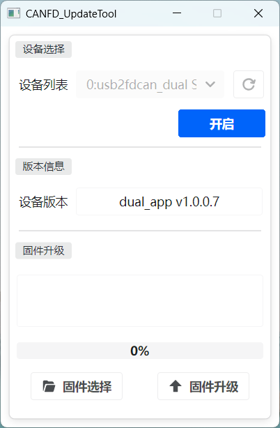

Reference firmware name:

```text
dm_usb2canfd_dual_gsusb_1004.enc
```

On Windows, unzip the upgrade tool, open the USB-CANFD device, select the `.enc` firmware above, then click firmware upgrade. Re-plug USB-CANFD after flashing.

Before flashing:

- The device may appear as `ttyACM*`.
- `lsusb` may show `DaMiao-Tech DM-USB2FDCAN`.

After flashing socketcan firmware and re-plugging:

- `lsusb` shows `1d50:606f OpenMoko ... CAN adapter`.
- Linux creates CAN network interfaces. If Jetson onboard CAN uses `can0`, the USB dual-channel adapter usually becomes `can1` and `can2`.

### 5.2 Build and Load gs_usb

For Jetson 5.15 kernels, CAN FD requires the custom `gs_usb` driver in `5.15/`.

```bash
sudo apt update
sudo apt install -y build-essential nvidia-l4t-kernel-headers
uname -r
ls -ld /lib/modules/$(uname -r)/build

cd ~/project/D1_rl_sar/5.15
make clean
make

sudo modprobe can
sudo modprobe can_raw
sudo modprobe can_dev
sudo modprobe -r gs_usb 2>/dev/null || true
sudo insmod ./gs_usb.ko
```

If a repeated `insmod` prints `File exists`, the module is already loaded; this is not a fault.

### 5.3 Recommended CANFD Autoload

The repository provides an autoload installer:

```bash
cd ~/project/D1_rl_sar/5.15/autoload
sudo bash install.sh
```

The script installs:

| File | Purpose |
|---|---|
| `/etc/modules-load.d/d1-can.conf` | Load `can`, `can_raw`, and `can_dev` at boot |
| `/etc/systemd/system/d1-gs-usb.service` | Load `gs_usb.ko` from the current path at boot |
| `/etc/udev/rules.d/85-d1-canfd.rules` | Watch CAN network interfaces created by `gs_usb` |
| `/etc/systemd/system/d1-canfd@.service` | Configure `1M arbitration / 5M data / restart-ms 100 / FD on`, set `txqueuelen 1000`, and bring the interface up |

Note: `install.sh` writes the absolute path of the current `5.15/gs_usb.ko` into `/etc/systemd/system/d1-gs-usb.service`. If you move the repository or want to confirm the path after rebuilding, run `sudo bash ~/project/D1_rl_sar/5.15/autoload/install.sh` again.

Check status:

```bash
systemctl --no-pager status d1-gs-usb.service
systemctl --no-pager status 'd1-canfd@can1.service' 'd1-canfd@can2.service'
ip -d link show can1
ip -d link show can2
```

Expected:

- `d1-gs-usb.service` is `active (exited)`.
- `can1` / `can2` show `bitrate 1000000`, `dbitrate 5000000`, `restart-ms 100`, `fd on`, and `qlen 1000`.
- If no real device is connected, the interface may show `NO-CARRIER`; this is not necessarily a fault.

Uninstall autoload:

```bash
sudo bash ~/project/D1_rl_sar/5.15/autoload/uninstall.sh
```

If the Jetson kernel is upgraded, rebuild `gs_usb.ko`:

```bash
cd ~/project/D1_rl_sar/5.15
make clean && make
sudo systemctl restart d1-gs-usb.service
```

### 5.4 Manual CANFD Configuration

If autoload is not installed, configure CANFD manually:

```bash
cd ~/project/D1_rl_sar/5.15
sudo modprobe can
sudo modprobe can_raw
sudo modprobe can_dev
lsmod | grep -q '^gs_usb' || sudo insmod ./gs_usb.ko

sudo ip link set can1 down 2>/dev/null || true
sudo ip link set can2 down 2>/dev/null || true
sudo ip link set can1 txqueuelen 1000
sudo ip link set can2 txqueuelen 1000

sudo ip link set can1 type can \
  bitrate 1000000 \
  dbitrate 5000000 \
  sample-point 0.75 \
  dsample-point 0.875 \
  restart-ms 100 \
  fd on

sudo ip link set can2 type can \
  bitrate 1000000 \
  dbitrate 5000000 \
  sample-point 0.75 \
  dsample-point 0.875 \
  restart-ms 100 \
  fd on

sudo ip link set can1 up
sudo ip link set can2 up
```

### 5.5 CANFD Loopback Test

Before connecting motors, run a dual-channel external loopback test. Connect `can1` and `can2` correctly according to the hardware documentation, then run:

Terminal 1:

```bash
sudo candump can2 -t a
```

Terminal 2:

```bash
sudo cansend can1 123##91122334455667788
```

If `candump` receives the frame, the firmware, driver, and dual-channel CAN FD link are basically working.

### 5.6 CAN Interface Convention

`rl_real_d1.cpp` is currently written for this Jetson real-robot deployment:

| Logical bus | SocketCAN interface | Purpose |
|---|---|---|
| CAN1 | `can1` | First group of 6 motors |
| CAN2 | `can2` | Second group of 6 motors |

No manual `can0/can1` to `can1/can2` source edit is needed.

## 6. Real Motor Parameters and Zero Calibration

### 6.1 Real Motor Setup

Before zero calibration, use the DaMiao debug assistant to configure all 12 leg `DM6248P` motors. This step is critical; make sure every motor uses the same parameter set.

The DaMiao debug assistant used for real motor setup is stored in this repository:

- DaMiao debug assistant: [docs/motor/tools/DMTool_v2.1.5.3.zip](docs/motor/tools/DMTool_v2.1.5.3.zip)

On Windows, unzip and run DMTool, connect USB-CANFD, then configure each motor from the parameter page.

Set motor ID:

- According to the hardware wiring diagram, set the corresponding `CAN ID` and `Master ID` for each motor.
- Each bus uses `0x01..0x06`.
- Set `Master ID` as `0x10 + CAN ID`; for example, when `CAN ID=0x06`, `Master ID=0x16`.

| Bus | CAN ID | Master ID | Joint |
|---|---|---|---|
| `can1` | `0x01` | `0x11` | FL_hip |
| `can1` | `0x02` | `0x12` | FL_thigh |
| `can1` | `0x03` | `0x13` | FL_calf |
| `can1` | `0x04` | `0x14` | FR_hip |
| `can1` | `0x05` | `0x15` | FR_thigh |
| `can1` | `0x06` | `0x16` | FR_calf |
| `can2` | `0x01` | `0x11` | RL_hip |
| `can2` | `0x02` | `0x12` | RL_thigh |
| `can2` | `0x03` | `0x13` | RL_calf |
| `can2` | `0x04` | `0x14` | RR_hip |
| `can2` | `0x05` | `0x15` | RR_thigh |
| `can2` | `0x06` | `0x16` | RR_calf |

Set motor baud rate:

- Set every motor's `CAN Baud` to `5M`.

Write these key parameters to all 12 `DM6248P` motors:

| Parameter | Value |
|---|---:|
| `PMAX` | `12.566` |
| `VMAX` | `20` |
| `TMAX` | `120` |
| `Current bandwidth` | `4000` |
| `Ki_current` | `10000` |
| `Ki_speed` | `1000` |

Use the DaMiao debug assistant's parameter page to modify each motor. After confirming `CAN ID`, `Master ID`, `CAN Baud`, and the parameters above, click the write-parameter button.

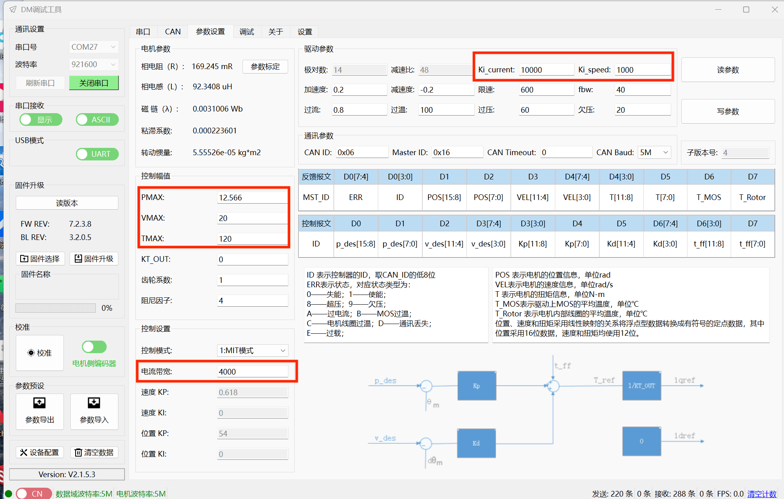

### 6.2 Motor Zero Calibration

D1 uses DaMiao `DM6248P` motors. The zero point is written into each motor's FLASH and is retained after power-off. Calibrate after first deployment, motor replacement, or mechanical reassembly.

Prerequisites:

- `can1` / `can2` are already `UP`.
- Motor CAN IDs on each bus are configured as `0x01..0x06`.
- The robot is suspended and all four legs can move freely.
- All 12 joints are placed at the mechanical zero pose.
- Programs that occupy CAN, such as `rl_real_d1` or `test_motor`, are not running.

Before setting zero, place every leg in the zero pose shown below:

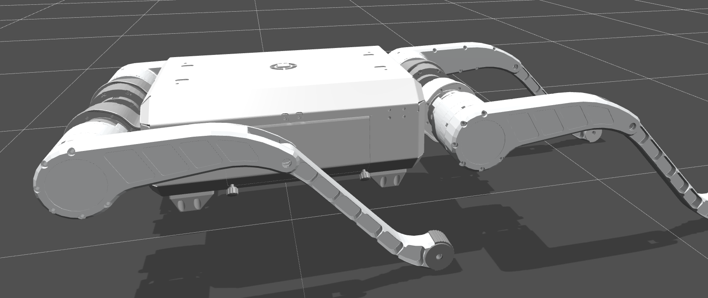

Requirements:

- The first motor on each leg, the yaw axis, should be horizontal.
- The third motor on each leg, the calf pitch axis, should be pushed to the mechanical limit.
- The second motor on each leg, the thigh pitch axis, should be aligned as shown below: make sure the motor serial port aligns with the nearby screw.

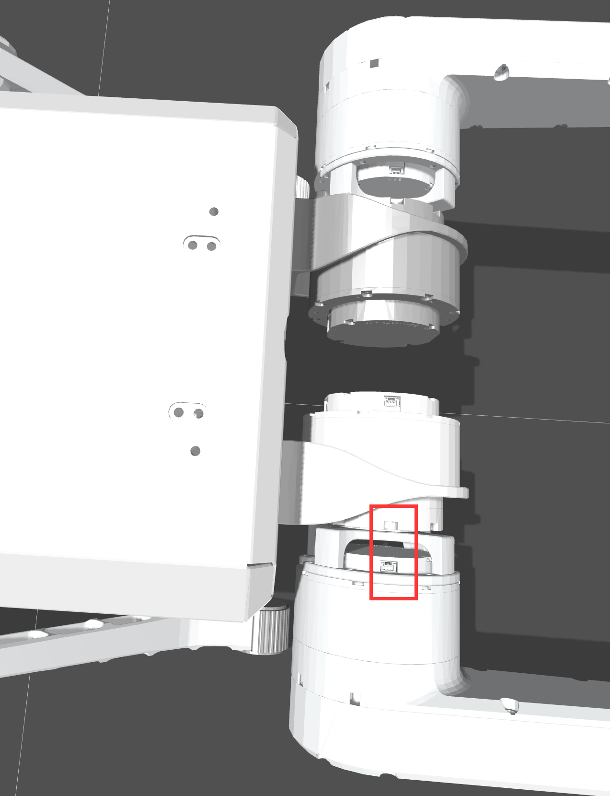

After all four legs are in this pose, run the zero-write command.

Whole-robot calibration:

```bash
source /opt/ros/humble/setup.bash
source ~/project/D1_rl_sar/rl_sar/install/setup.bash
ros2 run dmbot_serial set_zero_all
```

Single-motor correction:

```bash
ros2 run dmbot_serial set_zero_one can1 0x02
ros2 run dmbot_serial set_zero_one can2 5
```

CAN ID mapping:

| can1 ID | Joint | can2 ID | Joint |
|---|---|---|---|
| 0x01 | FL_hip | 0x01 | RL_hip |
| 0x02 | FL_thigh | 0x02 | RL_thigh |
| 0x03 | FL_calf | 0x03 | RL_calf |
| 0x04 | FR_hip | 0x04 | RR_hip |
| 0x05 | FR_thigh | 0x05 | RR_thigh |
| 0x06 | FR_calf | 0x06 | RR_calf |

After writing FLASH, physically power-cycle the motors, then run `set_zero_all` again and check only the BEFORE table. All values should be close to 0.

## 7. Real-Robot Runtime and Controls

### 7.1 Real-Robot Runtime

Safety requirement: for the first run, suspend the robot and confirm an emergency stop method works before entering stand-up or locomotion states.

One-command launch, suitable for Jetson sessions with a graphical environment:

```bash
source /opt/ros/humble/setup.bash
source ~/project/D1_rl_sar/rl_sar/install/setup.bash
ros2 launch rl_sar rl_real_d1.launch.py
```

`rl_real_d1.launch.py` starts:

- `dm_imu_node`
- `rl_real_d1`

Default IMU parameters:

```text
port=/dev/ttyACM0
baud=921600
```

Override IMU port:

```bash
ros2 launch rl_sar rl_real_d1.launch.py port:=/dev/ttyACM1 baud:=921600
```

Note: the launch file wraps `rl_real_d1` with `xterm -hold -e` because keyboard control requires a real TTY. For pure SSH without X11, start IMU and `rl_real_d1` in two terminals.

Terminal 1:

```bash
source /opt/ros/humble/setup.bash
source ~/project/D1_rl_sar/rl_sar/install/setup.bash
ros2 run dm_imu dm_imu_node --ros-args -p port:=/dev/ttyACM0 -p baud:=921600
```

Terminal 2:

```bash
source /opt/ros/humble/setup.bash
source ~/project/D1_rl_sar/rl_sar/install/setup.bash
ros2 run rl_sar rl_real_d1
```

### 7.2 Keyboard Control

`rl_real_d1` keyboard input requires a TTY. Common keys:

| Key | FSM transition |
|---|---|
| `0` | Passive / GetDown -> GetUp |
| `1` | GetUp / RLLocomotion -> RLLocomotion |
| `9` | GetUp / RLLocomotion -> GetDown |
| `P` | Any state -> Passive |

### 7.3 Gamepad Control

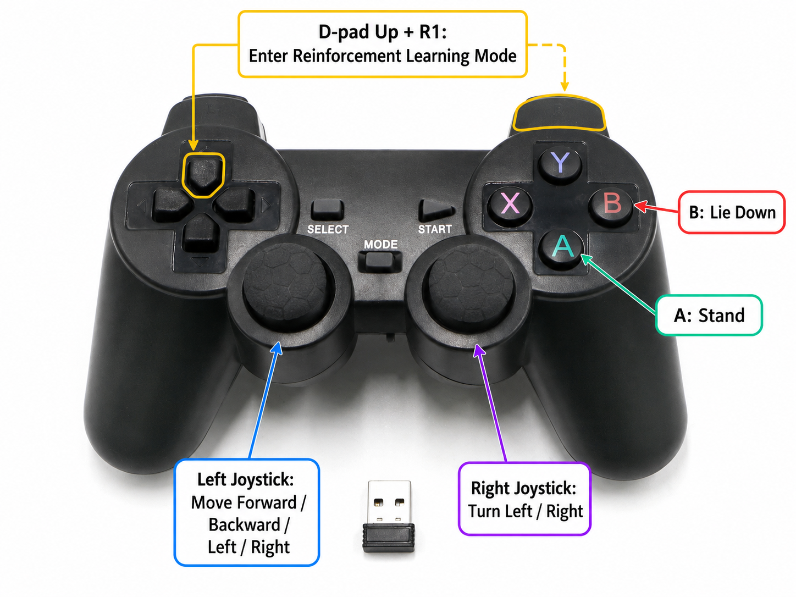

The program reads the Linux joystick device `/dev/input/js0`. Check:

```bash
ls -l /dev/input/js*
ls -l /dev/input/by-id/
```

Add the user to the `input` group:

```bash
sudo usermod -aG input $USER
```

Log in again and confirm `groups` includes `input`.

Common gamepad transitions:

| Action | FSM transition |
|---|---|
| `A` | Passive -> GetUp |
| `B` | GetUp / RLLocomotion -> GetDown |
| `LB + X` | Any state -> Passive |
| `RB + DPadUp` | GetUp / RLLocomotion -> RLLocomotion |

If no gamepad is connected, the program prints:

```text
Joystick [/dev/input/js0] open failed.
```

This is not blocking; keyboard control still works.

### 7.4 Power-On Trigger and L1 OFF Exit

To avoid manually running `ros2 launch` after Jetson powers on, the current real-robot deployment uses two systemd services:

| Service | Purpose |
|---|---|
| `rl-sar-trigger.service` | Starts at boot and lightly listens to `/dev/input/js0` `Y=button[3]` and DOG_CTRL serial `/dev/ttyTHS1` `L1 ON` |
| `rl-sar-main.service` | Not enabled; started only by the trigger and runs `rl_real_d1_headless.launch.py` |

Startup flow:

1. After power-on, only `rl-sar-trigger.service` stays resident.
2. Pressing ROS2 gamepad `Y`, or LoRa gamepad `L1 ON`, makes the trigger start `rl-sar-main.service`.
3. After the main service starts, `rl_real_d1` listens to DOG_CTRL by itself, and the trigger no longer occupies the serial port.
4. After the main service exits, the trigger returns to listening state. Pressing `Y` or `L1 ON` can start it again.

LoRa `L1 OFF` exit logic:

- DOG_CTRL `L1` is parsed as `bit8` by default, meaning `BTN:0100 -> BTN:0000`.
- When `L1` changes from ON to OFF, `rl_real_d1` first zeros the velocity command.
- If the robot is standing or walking, it requests `GetDown`, waits until the FSM returns to `Passive`, then calls ROS shutdown.
- `rl_real_d1_headless.launch.py` configures `OnProcessExit -> Shutdown` for `rl_real_d1`, so when `rl_real_d1` exits, the whole launch exits and `dm_imu_node` stops too.
- After `rl-sar-main.service` becomes inactive, the trigger takes over `/dev/ttyTHS1` again. The next `L1 ON` can start the robot again.

Default headless launch parameters:

```bash
dog_usb_l1_off_exit:=true
dog_usb_l1_button_bit:=8
dog_usb_l1_exit_timeout_ms:=8000
```

To verify that the parameters are installed in the current workspace:

```bash
cd $HOME/project/d1_rl_sar/rl_sar
source /opt/ros/humble/setup.bash
source install/setup.bash
ros2 launch rl_sar rl_real_d1_headless.launch.py --show-args | grep dog_usb_l1
```

After updating service templates, rebuild first so the templates under `install/share/rl_sar/systemd/` are refreshed, then run the installer. The installer writes the current workspace path to `/etc/default/rl-sar`, so any deployment user can use the same flow:

```bash
cd $HOME/project/D1_rl_sar/rl_sar
source /opt/ros/humble/setup.bash
./build.sh rl_sar
sudo bash install/share/rl_sar/systemd/install_rl_sar_services.sh
```

Field debug logs:

```bash
journalctl -u rl-sar-trigger.service -u rl-sar-main.service -f
```

Watch for:

- Whether `started rl-sar-main.service` appears after `L1 ON`.
- Whether `L1 OFF edge detected` appears after `L1 OFF`.
- Whether `rl-sar-main.service` becomes inactive after `rl_real_d1` exits.
- If logs show `cd: ... No such file or directory`, `RL_SAR_ROOT` in `/etc/default/rl-sar` is wrong. Run `cat /etc/default/rl-sar`; it should show the current workspace path, for example `$HOME/project/D1_rl_sar/rl_sar`.
- If ROS nodes fail with `failed to configure logging: Failed to get logging directory`, reinstall the service templates. The templates set absolute `ROS_HOME` and `ROS_LOG_DIR` paths for systemd.
- If `L1 OFF` does not work, first confirm `dog_usb_l1_button_bit:=8`. If the field BTN bit differs, change only this bit.
- If `OFF` exits motor control but the next `ON` does not respond, first confirm `rl_real_d1_headless.launch.py` includes `OnProcessExit -> Shutdown`, and that `install_rl_sar_services.sh` has been rerun.

## 8. Optional MuJoCo Simulation

MuJoCo is used for simulation or real-to-sim mapping checks. It is not part of the shortest real-robot deployment path.

Download MuJoCo:

```bash
cd ~/project/D1_rl_sar/rl_sar
bash scripts/download_mujoco.sh
```

Build MuJoCo:

```bash
cd ~/project/D1_rl_sar/rl_sar
./build.sh -mj
```

These build log messages can usually be ignored:

- `ROS_DISTRO not set, assuming non-ROS mode`: the MuJoCo build path is non-ROS.
- `LibTorch not found`: the current setup uses ONNX, so when `USE_ONNX: ON` and `USE_TORCH: OFF`, LibTorch is not required.
- GCC `note` messages about `std::pair<double, double>`: this is an aarch64 ABI note after GCC 10.1, not a build failure.

If the final output contains the following lines, the MuJoCo build succeeded:

```text
[100%] Built target rl_sim_mujoco
[SUCCESS] MuJoCo build completed!
```

Run the normal scene:

```bash
./cmake_build/bin/rl_sim_mujoco d1 scene
```

Run the terrain scene:

```bash
./cmake_build/bin/rl_sim_mujoco d1 scene_terrain
```

Real robot to MuJoCo mapping check:

```bash
source /opt/ros/humble/setup.bash
source ~/project/D1_rl_sar/rl_sar/install/setup.bash
ros2 launch rl_sar rl_real2mujoco.launch.py
```

Manual split startup:

```bash
ros2 run dm_imu dm_imu_node --ros-args -p port:=/dev/ttyACM0 -p baud:=921600
ros2 run rl_sar rl_real2mujoco d1 scene
```

Use this to check:

- Whether IMU roll / pitch / yaw directions match MuJoCo.
- Whether each motor direction has the same sign and magnitude.
- Whether CAN ID to FL / FR / RL / RR joint ordering is correct.

## 9. Short Startup Checklist

Prerequisites: CANFD autoload is installed, and the workspace is built.

1. Suspend the robot before power-on.
2. Connect IMU, USB-CANFD, and gamepad.
3. Check CAN:

```bash
ip -d link show can1
ip -d link show can2
systemctl --no-pager status d1-gs-usb.service 'd1-canfd@can1.service' 'd1-canfd@can2.service'
```

4. Start:

```bash
source /opt/ros/humble/setup.bash
source ~/project/D1_rl_sar/rl_sar/install/setup.bash
ros2 launch rl_sar rl_real_d1.launch.py
```

5. Press `0` first to enter GetUp.
6. After confirming the pose is stable, press `1` to enter RLLocomotion.
7. On abnormal behavior, press `P` or `LB + X` to return to Passive, then power off and inspect.

## 10. FAQ

### `ros2 pkg executables rl_sar` does not show `rl_real_d1`

Rebuild and source:

```bash
cd ~/project/D1_rl_sar/rl_sar
source /opt/ros/humble/setup.bash
./build.sh
source install/setup.bash
ros2 pkg executables rl_sar
```

### `d1_description` is missing from `colcon list`

Confirm the repository is up to date and the package exists:

```bash
ls src/rl_sar_zoo/d1_description/package.xml
colcon list --base-paths src | grep d1_description
```

### `can1` / `can2` do not exist

Check firmware, driver, and enumeration:

```bash
lsusb
lsmod | grep gs_usb
sudo dmesg | grep -i -E 'gs_usb|can|ttyACM' | tail -n 80
```

Confirm the USB-CANFD device has been flashed with socketcan firmware, then re-plug it.

### `d1-gs-usb.service` fails to start

A common cause is a stale `gs_usb.ko` after kernel upgrade:

```bash
cd ~/project/D1_rl_sar/5.15
make clean && make
sudo systemctl restart d1-gs-usb.service
```

### Keyboard does not respond after launch

Confirm `xterm` is installed and the current session has a graphical environment:

```bash
sudo apt install -y xterm
```

For pure SSH without X11, use two terminals to run IMU and `rl_real_d1` separately.

### MuJoCo build cannot find `glfw3`

If `./build.sh -mj` reports:

```text
Could not find a package configuration file provided by "glfw3"
```

Install the missing graphics dependencies and rebuild:

```bash
sudo apt update
sudo apt install -y libglfw3-dev libgl1-mesa-dev libxinerama-dev libxcursor-dev libxi-dev libxrandr-dev
cd ~/project/D1_rl_sar/rl_sar
rm -rf cmake_build
./build.sh -mj
```

## References

- NVIDIA SDK Manager: <https://developer.nvidia.com/sdk-manager>
- NVIDIA SDK Manager Jetson Direct Flash: <https://docs.nvidia.com/sdk-manager/install-with-sdkm-jetson-direct-flash/index.html>
- JetPack SDK 6.2.2: <https://developer.nvidia.com/embedded/jetpack-sdk-622>
- usbipd-win WSL support: <https://github.com/dorssel/usbipd-win/wiki/WSL-support>
- Upstream RL-SAR: <https://github.com/fan-ziqi/rl_sar>
- Project repository: <https://github.com/NavBotHub/D1_rl_sar>
