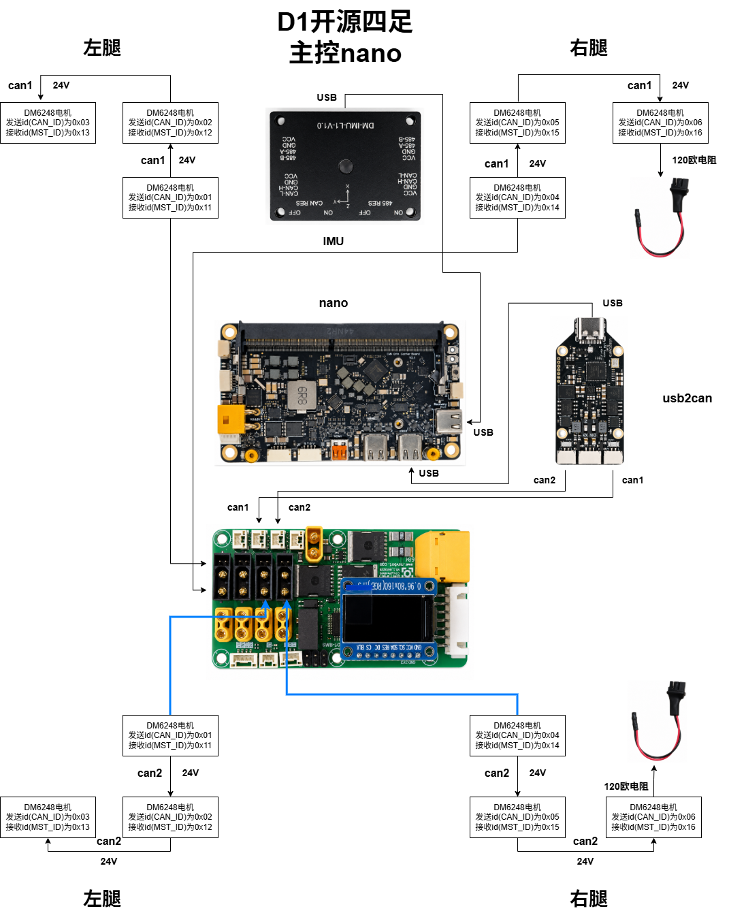
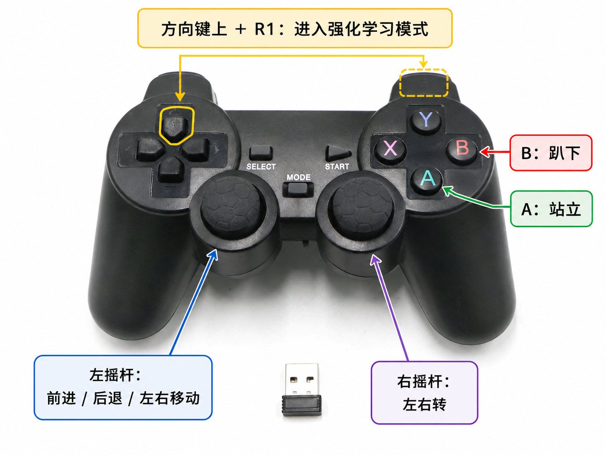

# D1 Jetson Orin USB-CANFD 真机部署 README


[English version](README.md)

> 本文 D1 真机部署流程按 Jetson Orin Nano Super、JetPack 6.2.2、Ubuntu 22.04、ROS 2 Humble、达妙 USB-CANFD 验证。

本文是 D1 真机部署手册，目标平台为 Jetson Orin Nano Super、JetPack 6.2.2、Ubuntu 22.04、ROS 2 Humble。通信方案使用达妙 `DM-USB2CANFD_Dual` 双路 USB-CAN FD，IMU 使用 `DM-IMU-L1`，腿部电机使用达妙 `DM6248P`。策略训练、checkpoint 验收和 ONNX 导出由 [D1 HIMLoco](https://gitee.com/lookc4/D1_himloco) 维护；本仓库从部署契约核对开始，继续完成 MuJoCo 和真机集成。

> [!CAUTION]
> 策略输出的关节目标会通过实时控制环发送到电机。必须先在 HIMLoco 和 MuJoCo 中验收 checkpoint；首次通电测试必须吊起机器人，保持急停和断电手段可立即操作，并在落地前核对关节顺序、方向、零位、IMU 方向、PD、CAN 映射和完整 ONNX 契约。

## 目录

- [1. 适用范围与部署流程](#1-适用范围与部署流程)
- [2. JetPack 6.2.2 系统烧录](#2-jetpack-622-系统烧录)
- [3. 首次开机、网络与源配置](#3-首次开机网络与源配置)
- [4. 仓库部署与编译](#4-仓库部署与编译)
- [5. USB-CANFD 与 gs_usb 驱动](#5-usb-canfd-与-gs_usb-驱动)
- [6. 实机电机参数与零点标定](#6-实机电机参数与零点标定)
- [7. 真机运行与控制](#7-真机运行与控制)
- [8. 真机前 MuJoCo 验证](#8-真机前-mujoco-验证)
- [9. 最短启动清单](#9-最短启动清单)
- [10. 常见问题](#10-常见问题)
- [参考资料](#参考资料)

## 1. 适用范围与部署流程

### 仓库边界

```text
D1 HIMLoco 数据集与训练
             ↓
checkpoint 仿真验收与 ONNX 导出
             ↓
RL-SAR 部署契约核对
             ↓
MuJoCo 仿真与映射检查
             ↓
吊起状态站立 / 下蹲 / 小命令测试
             ↓
受控落地验收
```

编译成功或 ONNX 能加载都不代表真机已经安全可用。应把编译检查、CAN 回环、吊起测试和落地测试作为独立关卡，测试结果记录在 README 之外。

### 硬件和系统要求

| 项目 | 要求 |
|---|---|
| 开发板 | Jetson Orin Nano Super |
| JetPack | JetPack 6.2.2 |
| Jetson Linux | Jetson Linux 36.5 |
| 系统 | Ubuntu 22.04 rootfs |
| 内核 | Jetson 5.15.x |
| ROS | ROS 2 Humble |
| 机器人 | D1 |
| IMU | DM-IMU-L1 |
| CAN | DM-USB2CANFD_Dual |
| 电机 | DM6248P |
| 推理 | ONNX Runtime，优先 CPU 跑通 |

如果内核不是 5.15.x，`5.15/gs_usb.ko` 需要重新确认兼容性；如果设备不是 `DM-USB2CANFD_Dual`，CAN 配置不能直接照抄。

## 2. JetPack 6.2.2 系统烧录

### 2.1 进入 Recovery 模式

第一次给 Jetson Orin Nano Super 烧录系统时，烧录前需要先让载板进入 Recovery 模式。操作顺序不要反过来：

1. 保持开发板断电。
2. 按住载板右侧的 `Recovery` 按键不松开。
3. 在按住 `Recovery` 的同时给开发板上电。
4. 上电后再松开 `Recovery`，然后用上位机继续执行系统烧录流程。

下图右侧标注的 `Recovery` 按键用于进入刷机模式：


注意：这是首次烧录系统时使用的 Recovery 启动方式，正常运行机器人时不需要按 `Recovery`，直接上电即可。

### 2.2 下载并打开 SDK Manager

先到 NVIDIA 官网下载并安装 SDK Manager：

<https://developer.nvidia.com/sdk-manager>

SDK Manager 用于下载 JetPack、刷写 Jetson Linux，并在镜像写入后继续安装 CUDA、Runtime 和其它 SDK components。

Windows 用户注意：NVIDIA 文档说明，从 JetPack 6.2.1 开始，Windows 主机刷写部分 Jetson 设备时会通过 WSL2 和 USBIPD 管理 USB 连接。如果 SDK Manager 自动流程失败，可以参考后面的 USBIPD 排障命令手动处理。

### 2.3 STEP 01 选择 Jetson 和 JetPack 6.2.2

SDK Manager 能检测到 Jetson Orin Nano 后，在 STEP 01 选择：

- Product Category：`Jetson`
- Target Hardware：检测到的 `Jetson Orin Nano`
- SDK Version：`JetPack 6.2.2`


### 2.4 STEP 02 选择组件

进入 STEP 02 后，`Jetson Linux` 一定要勾选；这是目标板系统镜像和刷机流程的核心组件。其它 Runtime / SDK 组件根据实际需求选择，磁盘空间充足时通常可以全部勾选。


### 2.5 Flash 前配置 Pre-Config 和 NVMe

开始烧录前，SDK Manager 会弹出 Flash 配置窗口：

- `OEM Configuration` 选择 `Pre-Config`。
- 在 `New Username` 和 `New Password` 填写自己的用户名和密码。
- `Storage Device` 选择 `NVMe`。
- 确认无误后点击 `Flash`，即可开始烧录。

注意：烧录过程偶尔可能失败，通常重新给 Jetson 断电再上电，并重新进入 Recovery 模式后再刷一次即可解决。


### 2.6 安装 SDK components

烧录进度大约到 25% 时，Jetson Orin Nano 的系统镜像通常已经写入完成，开发板可以正常开机。此时还只是基础系统镜像完成，SDK Manager 会继续安装前面勾选的 SDK 组件。

出现 SDK components 安装窗口时，先确认板子已经进入 Ubuntu 登录界面，然后填写连接信息：

- `Connection` 选择与板子的连接方式，一般保持默认 `USB`。
- `IP Address` 是 USB 连接方式下虚拟网卡的静态 IP，一般为 `192.168.55.1`，通常不用修改。
- `Username` 和 `Password` 填写前面在 `Pre-Config` 中设置的板端用户名和密码。
- 确认后点击 `Install`，继续安装 SDK 组件。


出现 `INSTALLATION COMPLETED SUCCESSFULLY` 后，说明烧录和 SDK 组件安装完成，可以点击 `FINISH` 退出。


### 2.7 USBIPD 排障

如果烧录中间遇到 USB 连接或设备识别问题，可以尝试在 **管理员 PowerShell** 中重新绑定并挂载 Jetson USB 设备到 WSL：

```powershell
usbipd list
usbipd bind --busid 1-3 --force
usbipd attach --wsl --busid 1-3
```

如果你的 `usbipd` 版本支持自动重连，也可以尝试：

```powershell
usbipd attach --wsl --busid 1-3 --auto-attach
```

如果不支持，就继续用普通 `attach`。

> 注意：上面的 `1-3` 只是示例，实际以你自己 `usbipd list` 看到的 BUSID 为准。

## 3. 首次开机、网络与源配置

### 3.1 有线联网并确认 IP

烧录完成后可能会发现 Jetson Orin Nano 暂时没有 WiFi。这通常是 JetPack 6.2.2 下无线网卡相关内核驱动缺失导致的，后续需要通过 apt 源安装对应组件来修复。

这时如果板子没有网络，最简单的处理方式是先插网线。如果路由器就在身边，可以直接把网线接到 Jetson Orin Nano 的网口，让板子先通过有线网络联网。

下图标注了载板背面的网口和 WiFi M.2 2230 位置：


拿到板子的 IP 地址后，再通过终端软件远程访问即可。IP 地址可以通过以下方式确认：

- 在路由器后台查看 DHCP 设备列表。
- 给 Jetson 接上屏幕、鼠标和键盘，在系统里查看网络 IP。
- 在 Jetson 终端中执行 `ip addr`，查看有线网卡拿到的地址。

远程登录示例：

```bash
ssh <用户名>@<板子IP>
```

### 3.2 更换 APT 源并添加 ROS2 源

有了网络之后，先使用小鱼的一键工具更换系统源，以提高 APT 下载速度：

```bash
wget http://fishros.com/install -O fishros && . fishros
```

进入菜单后输入 `5`，选择“系统源（更换系统源，支持全版本 Ubuntu 系统）”。


进入系统源工具后会出现两个选项：

- `[1]`：仅更换系统源。
- `[2]`：更换系统源并清理第三方源。

**这里一定选择 `[1]`，不要选择 `[2]`。** Jetson 系统里会有 NVIDIA / JetPack 相关的第三方源，选择清理第三方源可能把这些源删掉，后续安装驱动、JetPack 组件或 ROS2 依赖时容易出问题。

换完系统源后，再添加 ROS2 源。可以继续使用小鱼工具里的 ROS / ROS2 相关选项添加 ROS2 源；后续本文默认使用 ROS 2 Humble。

### 3.3 修复 JetPack 6.2.2 WiFi 驱动

换源并确认 apt 可用后，在 SSH 终端中执行以下命令，可以修复 JetPack 6.2.2 下 Jetson Orin Nano 无 WiFi 的问题：

```bash
sudo rm /lib/modules/5.15.185-tegra/build
sudo ln -s /usr/src/linux-headers-5.15.185-tegra-ubuntu22.04_aarch64/3rdparty/canonical/linux-jammy/kernel-source/ /lib/modules/5.15.185-tegra/build
sudo apt install -y iwlwifi-modules
sudo reboot
```

注意：随着 JetPack / Jetson Linux 版本更新，每块板子的内核版本可能不同。上面的 `5.15.185-tegra` 和 `linux-headers-5.15.185-tegra-ubuntu22.04_aarch64` 只是当前示例，实际输入时建议多用 `Tab` 补全，匹配自己板子上真实存在的目录。

重启后一般就可以看到 WiFi，后续可以通过 WiFi 连接 Jetson Orin Nano。

## 4. 仓库部署与编译

### 4.1 仓库路径

本文假设仓库位于：

```bash
~/project/D1_rl_sar
```

克隆：

```bash
mkdir -p ~/project
cd ~/project
git clone https://github.com/NavBotHub/D1_rl_sar.git
cd ~/project/D1_rl_sar/rl_sar
```

如果 GitHub 访问不便，可使用 Gitee 镜像：

```bash
git clone https://gitee.com/lookc4/D1_rl_sar.git ~/project/D1_rl_sar
cd ~/project/D1_rl_sar/rl_sar
```

兼容说明：后续文档统一使用 `~/project/D1_rl_sar`。如果现有机器仍是 `~/project/d1_rl_sar`，可以继续按真实路径进入，也可以重命名或重新克隆到 `~/project/D1_rl_sar`。

### 4.2 修改设备树：适配达妙载板

官方 Jetson Orin Nano 开发套件不需要执行本步骤。达妙第三方载板使用板载 LoRa DOG_CTRL 串口前，先在克隆本仓库后安装仓库内 DTB。脚本固定使用：

```text
docs/dtb/kernel_tegra234-p3768-0000+p3767-0003-nv.dtb
```

安装命令：

```bash
cd $HOME/project/D1_rl_sar
sudo bash docs/dtb/install_dmgo_dtb.sh
sudo reboot
```

脚本会把 DTB 复制到 `/boot/dtb/`，备份已有 DTB 和 `/boot/extlinux/extlinux.conf`，并给 `primary` 启动项显式加入指向该 DTB 的 `FDT` 行。不要只手动复制 DTB 到 `/boot/dtb/`；这条 Jetson 启动链只有在 extlinux 启动项显式配置 `FDT` 行时才会使用 `/boot/dtb/` 里的文件。

重启后验证：

```bash
tr -d '\0' < /proc/device-tree/compatible; echo

for s in 3100000 3110000 3140000; do
  echo "===== serial@$s ====="
  tr -d '\0' < /proc/device-tree/bus@0/serial@$s/status 2>/dev/null || echo "no status"
  echo
done
```

预期结果：

```text
compatible 包含 p3767-0003
serial@3110000 = okay
```

LoRa DOG_CTRL 仍按 `/dev/ttyTHS1` 检查：

```bash
sudo stty -F /dev/ttyTHS1 115200 raw -echo
sudo timeout 2s cat /dev/ttyTHS1 | xxd -g 1 -c 24 | head
```

正常 DOG_CTRL 帧头为：

```text
44 54 01 20
```

### 4.3 安装基础依赖

先安装 ROS 2 Humble 基础环境。已经装过 ROS 源时执行：

```bash
sudo apt update
sudo apt upgrade -y
sudo apt install -y ros-humble-ros-base ros-dev-tools
source /opt/ros/humble/setup.bash
```

安装项目依赖：

```bash
sudo apt install -y \
  git curl unzip locales software-properties-common \
  cmake g++ build-essential \
  libyaml-cpp-dev libeigen3-dev libboost-dev libboost-all-dev libspdlog-dev libfmt-dev libtbb-dev liblcm-dev \
  python3-colcon-common-extensions \
  ros-humble-rclcpp ros-humble-rclpy \
  ros-humble-geometry-msgs ros-humble-sensor-msgs ros-humble-std-msgs ros-humble-std-srvs \
  ros-humble-tf2 ros-humble-tf2-ros ros-humble-tf2-geometry-msgs \
  ros-humble-realtime-tools ros-humble-hardware-interface ros-humble-controller-interface \
  ros-humble-pluginlib ros-humble-urdf ros-humble-rcl-interfaces ros-humble-rosidl-default-generators \
  ros-humble-ros2-control ros-humble-ros2-controllers ros-humble-joint-state-broadcaster \
  ros-humble-control-toolbox ros-humble-robot-state-publisher ros-humble-joint-state-publisher-gui \
  ros-humble-xacro ros-humble-teleop-twist-keyboard \
  libglfw3-dev libgl1-mesa-dev libxinerama-dev libxcursor-dev libxi-dev libxrandr-dev \
  can-utils xterm
```

其中 `libglfw3-dev` 和 OpenGL / X11 相关开发包用于后续 `./build.sh -mj` 编译 MuJoCo 可视化仿真；如果缺少它们，CMake 可能会报 `Could not find a package configuration file provided by "glfw3"`。

`libtbb-dev` 提供 MuJoCo / CMake 编译需要的 TBB CMake 包配置文件。如果 CMake 报 `TBBConfig.cmake` 或 `tbb-config.cmake` 缺失，单独安装：

```bash
sudo apt install -y libtbb-dev
```

### 4.4 下载推理运行库

仓库不提交 `rl_sar/library/` 里的解压后运行库，但已随仓库提供 Jetson Orin Nano / Linux aarch64 使用的 ONNX Runtime 1.22.0 归档包：

```text
rl_sar/third_party/onnxruntime/onnxruntime-linux-aarch64-1.22.0.tgz
```

在 Jetson 上执行下面命令时，脚本会优先使用这个本地归档包并解压到 `rl_sar/library/inference_runtime/onnxruntime`；只有对应平台归档包不存在时，才会从 GitHub 下载。

注意：这个内置包是 `aarch64` 架构，只给 Jetson 使用；如果在 x86_64 的 Ubuntu / WSL 开发机上执行，脚本会按当前机器架构查找 x64 包，不会使用这个 aarch64 包。

```bash
cd ~/project/D1_rl_sar/rl_sar
bash scripts/download_inference_runtime.sh onnx
```

### 4.5 核对 HIMLoco ONNX 部署契约

部署文件位于：

```text
rl_sar/policy/d1/base.yaml
rl_sar/policy/d1/robot_lab/config.yaml
rl_sar/policy/d1/robot_lab/policy_onnx.onnx
```

当前策略契约如下：

| 项目 | 必须一致的值或顺序 |
|---|---|
| 单帧观测 | 45：`commands(3) + ang_vel(3) + gravity_vec(3) + dof_pos(12) + dof_vel(12) + actions(12)` |
| 观测历史 | `[0,1,2,3,4,5]`，time-priority，0 为最新帧 |
| ONNX 输入 / 输出 | 270（45 × 6）/ 12 个关节动作 |
| 控制周期 | `dt=0.005 s`、`decimation=4`，策略周期 0.02 s |
| 关节顺序 | FL、FR、RL、RR；每条腿依次 hip、thigh、calf |
| 默认姿态 | 左腿 `[-0.05,-0.75,-0.75]`；右腿 `[0.05,-0.75,-0.75]` |
| RL Kp / Kd | 每条腿 `[50,55,55]` / `[3.2,3.5,3.5]` |
| action scale | 每条腿 `[0.35,0.55,0.80]` |
| torque limit | 每个关节 50 |

替换模型前必须比较输入输出 shape、历史顺序、关节顺序、默认姿态、PD、action scale、torque 行为、控制周期、命令整形，以及导出与部署 ONNX 的 SHA256。模型必须先通过 HIMLoco checkpoint 验收和 RL-SAR MuJoCo 验证，才能进入通电测试。

`commands_scale: [2.0, 2.0, 0.25]` 是观测归一化尺度，不是物理命令上限。当前纯轴部署范围是 `vx [-0.60,0.90] m/s`、`vy ±0.40 m/s`、`wz ±0.50 rad/s`，对应加速/减速限制分别为 `1.6/2.4`、`1.2/1.8`、`2.0/3.0`。对角和移动+yaw 命令还会额外投影。唯一事实来源是 `rl_sar/src/rl_sar/include/command_shaping.hpp`；dataset 支持更宽不代表可以扩大真机命令。

交接时记录两个文件的哈希：

```bash
sha256sum <HIMLOCO_EXPORTED_POLICY>/policy_onnx.onnx
sha256sum ~/project/D1_rl_sar/rl_sar/policy/d1/robot_lab/policy_onnx.onnx
```

### 4.6 ROS2 编译

普通 ROS2 编译：

```bash
cd ~/project/D1_rl_sar/rl_sar
source /opt/ros/humble/setup.bash
export CMAKE_BUILD_PARALLEL_LEVEL=1
./build.sh
```

编译后检查：

```bash
source install/setup.bash
colcon list --base-paths src
ros2 pkg executables rl_sar
ros2 pkg executables dm_imu
ldd install/lib/rl_sar/rl_real_d1 | grep 'not found' || true
```

期望看到类似下面输出：

```text
d1_description  src/rl_sar_zoo/d1_description   (ros.ament_cmake)
dm_imu  src/dm_imu      (ros.ament_cmake)
dmbot_serial    src/dmbot_serial        (ros.ament_cmake)
rl_sar  src/rl_sar      (ros.ament_cmake)
robot_joint_controller  src/robot_joint_controller      (ros.ament_cmake)
robot_msgs      src/robot_msgs  (ros.ament_cmake)
serial  src/serial      (ros.ament_cmake)
rl_sar rl_real_d1
rl_sar rl_real_d1_trigger
dm_imu dm_imu_node
```

重点确认：

- `colcon list --base-paths src` 能列出 `d1_description`、`dm_imu`、`dmbot_serial`、`rl_sar` 等包。
- `ros2 pkg executables rl_sar` 能看到 `rl_real_d1`。
- `ros2 pkg executables dm_imu` 能看到 `dm_imu_node`。
- `ldd ... | grep 'not found'` 没有输出表示动态库完整。

### 4.7 配置 shell 自动 source

编译成功后，可以把 ROS 和项目 setup 加入 `~/.bashrc`：

```bash
cat >> ~/.bashrc <<'EOF'

source /opt/ros/humble/setup.bash
if [ -f "$HOME/project/D1_rl_sar/rl_sar/install/setup.bash" ]; then
  source "$HOME/project/D1_rl_sar/rl_sar/install/setup.bash"
fi
EOF
```

当前终端立即生效：

```bash
source ~/.bashrc
```

### 4.8 IMU 验证

串口权限：

```bash
groups
sudo usermod -aG dialout $USER
newgrp dialout
```

启动 IMU，实际验证串口为 `/dev/ttyACM0`：

```bash
source /opt/ros/humble/setup.bash
source ~/project/D1_rl_sar/rl_sar/install/setup.bash
ros2 run dm_imu dm_imu_node --ros-args -p port:=/dev/ttyACM0 -p baud:=921600
```

另开终端检查：

```bash
source /opt/ros/humble/setup.bash
source ~/project/D1_rl_sar/rl_sar/install/setup.bash
ros2 topic echo /imu/data --once
```

看到 `sensor_msgs/msg/Imu` 即为正常。

## 5. USB-CANFD 与 gs_usb 驱动

### 5.1 USB-CANFD 固件

`DM-USB2CANFD_Dual` 出厂固件通常不是 Linux SocketCAN 模式。使用 SocketCAN 前，需要用达妙官方升级工具刷入 socketcan 固件。

仓库内已放入本次验证使用的升级工具和固件：

- 升级工具：[docs/usb2canfd/tools/USB2CANFD_UpdateTool.zip](docs/usb2canfd/tools/USB2CANFD_UpdateTool.zip)
- SocketCAN 固件：[docs/usb2canfd/firmware/dm_usb2canfd_dual_gsusb_1004.enc](docs/usb2canfd/firmware/dm_usb2canfd_dual_gsusb_1004.enc)

烧录界面参考：


参考固件名：

```text
dm_usb2canfd_dual_gsusb_1004.enc
```

烧录时在 Windows 上解压升级工具，打开设备后选择上面的 `.enc` 固件，再点击固件升级。刷入完成后重新插拔 USB-CANFD。

刷入前常见现象：

- 设备可能表现为 `ttyACM*`。
- `lsusb` 可能显示 `DaMiao-Tech DM-USB2FDCAN`。

刷入 socketcan 固件并重新插拔后，正常现象：

- `lsusb` 显示 `1d50:606f OpenMoko ... CAN adapter`。
- Linux 下出现 CAN 网卡，Jetson 板载 CAN 占用 `can0` 时，USB 双路通常是 `can1` 和 `can2`。

### 5.2 编译并加载 gs_usb 驱动

Jetson 5.15 内核下，CAN FD 需要使用仓库 `5.15/` 里的自定义 `gs_usb` 驱动。

```bash
sudo apt update
sudo apt install -y build-essential nvidia-l4t-kernel-headers
uname -r
ls -ld /lib/modules/$(uname -r)/build

cd ~/project/D1_rl_sar/5.15
make clean
make

sudo modprobe can
sudo modprobe can_raw
sudo modprobe can_dev
sudo modprobe -r gs_usb 2>/dev/null || true
sudo insmod ./gs_usb.ko
```

再次 `insmod` 如果提示 `File exists`，说明模块已经加载，不是故障。

### 5.3 推荐：开机自动加载 CANFD

仓库已经提供自动加载脚本：

```bash
cd ~/project/D1_rl_sar/5.15/autoload
sudo bash install.sh
```

脚本会安装：

| 文件 | 作用 |
|---|---|
| `/etc/modules-load.d/d1-can.conf` | 开机加载 `can`、`can_raw`、`can_dev` |
| `/etc/systemd/system/d1-gs-usb.service` | 开机加载当前路径下的 `gs_usb.ko` |
| `/etc/udev/rules.d/85-d1-canfd.rules` | 监听 `gs_usb` 生成的 CAN 网卡 |
| `/etc/systemd/system/d1-canfd@.service` | 自动配置 `1M arbitration / 5M data / restart-ms 100 / FD on`，设置 `txqueuelen 1000` 并拉起接口 |

注意：`install.sh` 会把当前 `5.15/gs_usb.ko` 的绝对路径写入 `/etc/systemd/system/d1-gs-usb.service`。如果后续移动了仓库目录，或者重新编译后想确认路径正确，建议重新执行一次 `sudo bash ~/project/D1_rl_sar/5.15/autoload/install.sh`。

检查状态：

```bash
systemctl --no-pager status d1-gs-usb.service
systemctl --no-pager status 'd1-canfd@can1.service' 'd1-canfd@can2.service'
ip -d link show can1
ip -d link show can2
```

期望：

- `d1-gs-usb.service` 为 `active (exited)`。
- `can1` / `can2` 已配置 `bitrate 1000000`、`dbitrate 5000000`、`restart-ms 100`、`fd on`，并且 `qlen` 为 `1000`。
- 未接真实设备时，接口可能显示 `NO-CARRIER`，这不一定是故障。

卸载自动加载：

```bash
sudo bash ~/project/D1_rl_sar/5.15/autoload/uninstall.sh
```

如果 Jetson 内核升级，必须重新编译 `gs_usb.ko`：

```bash
cd ~/project/D1_rl_sar/5.15
make clean && make
sudo systemctl restart d1-gs-usb.service
```

### 5.4 手动配置 CANFD

如果没有安装自动加载，手动执行：

```bash
cd ~/project/D1_rl_sar/5.15
sudo modprobe can
sudo modprobe can_raw
sudo modprobe can_dev
lsmod | grep -q '^gs_usb' || sudo insmod ./gs_usb.ko

sudo ip link set can1 down 2>/dev/null || true
sudo ip link set can2 down 2>/dev/null || true
sudo ip link set can1 txqueuelen 1000
sudo ip link set can2 txqueuelen 1000

sudo ip link set can1 type can \
  bitrate 1000000 \
  dbitrate 5000000 \
  sample-point 0.75 \
  dsample-point 0.875 \
  restart-ms 100 \
  fd on

sudo ip link set can2 type can \
  bitrate 1000000 \
  dbitrate 5000000 \
  sample-point 0.75 \
  dsample-point 0.875 \
  restart-ms 100 \
  fd on

sudo ip link set can1 up
sudo ip link set can2 up
```

### 5.5 CANFD 回环测试

在未接电机前，建议先做双通道外部回环。按硬件说明把 `can1` 和 `can2` 正确连接后执行：

终端 1：

```bash
sudo candump can2 -t a
```

终端 2：

```bash
sudo cansend can1 123##91122334455667788
```

`candump` 能收到报文，说明固件、驱动和双路 CAN FD 链路基本正常。

### 5.6 CAN 接口约定

当前 `rl_real_d1.cpp` 已经按 Jetson 实机部署约定写成：

| 逻辑总线 | SocketCAN 接口 | 用途 |
|---|---|---|
| CAN1 | `can1` | 第一组 6 个电机 |
| CAN2 | `can2` | 第二组 6 个电机 |

不需要再手工把 `can0/can1` 改成 `can1/can2`。

## 6. 实机电机参数与零点标定

### 6.1 实机电机设置

零点标定前，需要先用达妙调试助手完成 12 个腿部 `DM6248P` 电机的基础配置。这一步很关键，必须确保每个电机参数一致。

仓库内已放入实机电机设置使用的达妙调试助手：

- 达妙调试助手：[docs/motor/tools/DMTool_v2.1.5.3.zip](docs/motor/tools/DMTool_v2.1.5.3.zip)

在 Windows 上解压后运行 DMTool，连接 USB-CANFD，再进入参数设置页逐个配置电机。

设置电机 ID：

- 根据硬件接线图，给每个电机设置对应的 `CAN ID` 和 `Master ID`。
- 每条总线使用 `0x01..0x06`。
- `Master ID` 按 `0x10 + CAN ID` 设置，例如 `CAN ID=0x06` 时，`Master ID=0x16`。




设置电机波特率：

- 每个电机的 `CAN Baud` 都改成 `5M`。

给 12 个 `DM6248P` 电机写入以下关键参数：

| 参数 | 值 |
|---|---:|
| `PMAX` | `12.566` |
| `VMAX` | `20` |
| `TMAX` | `120` |
| `电流带宽` | `4000` |
| `Ki_current` | `10000` |
| `Ki_speed` | `1000` |

用达妙调试助手在“参数设置”页逐个电机修改，确认 `CAN ID`、`Master ID`、`CAN Baud` 和上表参数无误后点击“写参数”。


### 6.2 电机零点标定

D1 使用达妙 `DM6248P` 电机。零点写入每颗电机自己的 FLASH，断电不丢失。首次部署、换电机或机械重装后必须标定。

前置条件：

- `can1` / `can2` 已经 `UP`。
- 每条总线的电机 CAN ID 已设置为 `0x01..0x06`。
- 机器人吊起，四条腿可自由活动。
- 12 个关节摆到机械零点姿态。
- `rl_real_d1`、`test_motor` 等会占用 CAN 的程序都没有运行。

设置零点前，按照下图把每条腿摆到零点姿态：


具体要求：

- 每条腿第一个电机，也就是 yaw 轴，保持水平。
- 每条腿第三个电机，也就是小腿 pitch 轴，需要顶到机械限位。
- 每条腿第二个电机，也就是大腿 pitch 轴，按下图对齐：确保电机串口和旁边这颗螺丝对齐。


确认四条腿都摆到上述姿态后，再执行写零点命令。

全车标定：

```bash
source /opt/ros/humble/setup.bash
source ~/project/D1_rl_sar/rl_sar/install/setup.bash
ros2 run dmbot_serial set_zero_all
```

单电机补标：

```bash
ros2 run dmbot_serial set_zero_one can1 0x02
ros2 run dmbot_serial set_zero_one can2 5
```

CAN ID 对应关系：

| can1 ID | 关节 | can2 ID | 关节 |
|---|---|---|---|
| 0x01 | FL_hip | 0x01 | RL_hip |
| 0x02 | FL_thigh | 0x02 | RL_thigh |
| 0x03 | FL_calf | 0x03 | RL_calf |
| 0x04 | FR_hip | 0x04 | RR_hip |
| 0x05 | FR_thigh | 0x05 | RR_thigh |
| 0x06 | FR_calf | 0x06 | RR_calf |

写入 FLASH 后建议给电机物理断电再上电，然后重新跑 `set_zero_all`，只看 BEFORE 表格是否全部接近 0。

## 7. 真机运行与控制

每次更换 ONNX 或部署参数后，都必须先完成第 8 节验证，再执行本节真机命令。首次通电仍必须吊起机器人并从小命令开始。

### 7.1 真机运行

安全要求：首次运行必须吊起机器人，确认急停方式可用，再进入站立或行走状态。

一键 launch，适合有图形环境的 Jetson：

```bash
source /opt/ros/humble/setup.bash
source ~/project/D1_rl_sar/rl_sar/install/setup.bash
ros2 launch rl_sar rl_real_d1.launch.py
```

`rl_real_d1.launch.py` 会同时启动：

- `dm_imu_node`
- `rl_real_d1`

默认 IMU 参数：

```text
port=/dev/ttyACM0
baud=921600
```

覆盖 IMU 串口：

```bash
ros2 launch rl_sar rl_real_d1.launch.py port:=/dev/ttyACM1 baud:=921600
```

注意：launch 会用 `xterm -hold -e` 包住 `rl_real_d1`，因为键盘控制需要真实 TTY。纯 SSH 无 X11 时，改用两个终端分别启动。

终端 1：

```bash
source /opt/ros/humble/setup.bash
source ~/project/D1_rl_sar/rl_sar/install/setup.bash
ros2 run dm_imu dm_imu_node --ros-args -p port:=/dev/ttyACM0 -p baud:=921600
```

终端 2：

```bash
source /opt/ros/humble/setup.bash
source ~/project/D1_rl_sar/rl_sar/install/setup.bash
ros2 run rl_sar rl_real_d1
```

### 7.2 键盘控制

`rl_real_d1` 的键盘输入需要 TTY。常用按键：

单纯键盘控制启动：

```bash
ros2 launch rl_sar rl_real_d1.launch.py \
  dog_usb_enable:=false \
  keyboard_enable:=true
```

| 按键 | FSM 切换 |
|---|---|
| `0` | Passive / GetDown -> GetUp |
| `1` | GetUp / RLLocomotion -> RLLocomotion |
| `9` | GetUp / RLLocomotion -> GetDown |
| `P` | 任意状态 -> Passive |

### 7.3 手柄控制



单纯 ROS2 手柄控制启动：

```bash
ros2 launch rl_sar rl_real_d1_headless.launch.py \
  dog_usb_enable:=false \
  keyboard_enable:=false \
  sys_joystick_device:=/dev/input/js0
```

程序硬编码读取 Linux joystick 设备 `/dev/input/js0`。检查：

```bash
ls -l /dev/input/js*
ls -l /dev/input/by-id/
```

建议把用户加入 `input` 组：

```bash
sudo usermod -aG input $USER
```

重新登录后确认 `groups` 包含 `input`。

常用手柄切换：

| 操作 | FSM 切换 |
|---|---|
| `A` | Passive -> GetUp |
| `B` | GetUp / RLLocomotion -> GetDown |
| `LB + X` | 任意状态 -> Passive |
| `RB + DPadUp` | GetUp / RLLocomotion -> RLLocomotion |

没有手柄时，程序会打印：

```text
Joystick [/dev/input/js0] open failed.
```

这不是阻塞项，键盘控制仍可使用。

### 7.4 上电按键触发启动与 L1 OFF 退出

为了避免 Jetson 上电后手动执行 `ros2 launch`，当前实机部署使用两个 systemd 服务：

| 服务 | 作用 |
|---|---|
| `rl-sar-trigger.service` | 开机自启，轻量监听 `/dev/input/js0` 的 `Y=button[3]` 和 DOG_CTRL 串口 `/dev/ttyTHS1` 的 `L1 ON` |
| `rl-sar-main.service` | 不 enable，只由触发器启动，运行 `rl_real_d1_headless.launch.py` 真机控制 |

启动链路：

1. 上电后只有 `rl-sar-trigger.service` 常驻运行。
2. ROS2 手柄按 `Y`，或 LoRa 手柄 `L1 ON`，触发器启动 `rl-sar-main.service`。
3. 主服务运行后，`rl_real_d1` 自己监听 DOG_CTRL，触发器不再占用串口。
4. 主服务退出后，触发器重新进入监听状态，之后还能再次按 `Y` 或 `L1 ON` 启动。

LoRa `L1 OFF` 退出逻辑：

- DOG_CTRL 中 `L1` 默认按 `bit8` 解析，也就是 `BTN:0100 -> BTN:0000`。
- 检测到 `L1` 从 ON 变成 OFF 后，`rl_real_d1` 会先把速度命令清零。
- 如果当前处于站立或行走状态，会请求 `GetDown`，等 FSM 回到 `Passive` 后再调用 ROS shutdown。
- `rl_real_d1_headless.launch.py` 已给 `rl_real_d1` 配置 `OnProcessExit -> Shutdown`，所以 `rl_real_d1` 退出时整个 launch 会一起退出，`dm_imu_node` 也会停止。
- `rl-sar-main.service` 变成 inactive 后，触发器会重新接管 `/dev/ttyTHS1`，下一次 `L1 ON` 可以再次启动。

headless launch 默认参数：

```bash
dog_usb_l1_off_exit:=true
dog_usb_l1_button_bit:=8
dog_usb_l1_exit_timeout_ms:=8000
```

如需前台验证参数是否已经安装到当前工作区：

```bash
cd $HOME/project/D1_rl_sar/rl_sar
source /opt/ros/humble/setup.bash
source install/setup.bash
ros2 launch rl_sar rl_real_d1_headless.launch.py --show-args | grep dog_usb_l1
```

更新 service 模板后，需要先重新构建，让 `install/share/rl_sar/systemd/` 里的模板同步更新，再运行安装脚本。脚本会按当前工作区路径写入 `/etc/default/rl-sar`，因此不同用户名都可以使用同一套流程：

```bash
cd $HOME/project/D1_rl_sar/rl_sar
source /opt/ros/humble/setup.bash
./build.sh rl_sar
sudo bash install/share/rl_sar/systemd/install_rl_sar_services.sh --root "$(pwd)"
```

现场调试日志：

```bash
journalctl -u rl-sar-trigger.service -u rl-sar-main.service -f
```

重点观察：

- `L1 ON` 后是否出现 `started rl-sar-main.service`。
- `L1 OFF` 后是否出现 `L1 OFF edge detected`。
- `rl_real_d1` 退出后 `rl-sar-main.service` 是否变成 inactive。
- 如果日志出现 `cd: ... No such file or directory`，说明 `/etc/default/rl-sar` 里的 `RL_SAR_ROOT` 不正确；执行 `cat /etc/default/rl-sar`，应看到当前工作区路径，例如 `$HOME/project/D1_rl_sar/rl_sar`。
- 如果 ROS 节点报 `failed to configure logging: Failed to get logging directory`，重新安装 service 模板；模板会给 systemd 设置绝对路径的 `ROS_HOME` 和 `ROS_LOG_DIR`。
- 如果 `L1 OFF` 没反应，优先确认 `dog_usb_l1_button_bit:=8`；如现场 BTN 位不一致，只改这个 bit。
- 如果 `OFF` 后能退出电机控制但再次 `ON` 没反应，优先确认 `rl_real_d1_headless.launch.py` 已经包含 `OnProcessExit -> Shutdown`，并且已经重新运行 `install_rl_sar_services.sh`。

## 8. 真机前 MuJoCo 验证

MuJoCo 是 HIMLoco checkpoint 验收和真机通电之间的部署关卡，用于在不驱动物理电机的情况下检查策略加载、关节顺序、默认姿态、命令方向、状态切换和真机映射。

下载 MuJoCo：

```bash
cd ~/project/D1_rl_sar/rl_sar
bash scripts/download_mujoco.sh
```

编译 MuJoCo：

```bash
cd ~/project/D1_rl_sar/rl_sar
./build.sh -mj
```

编译日志里这些提示通常可以忽略：

- `ROS_DISTRO not set, assuming non-ROS mode`：MuJoCo 编译链路是非 ROS 模式。
- `LibTorch not found`：当前使用 ONNX，`USE_ONNX: ON`、`USE_TORCH: OFF` 时不需要 LibTorch。
- GCC 关于 `std::pair<double, double>` 的 `note`：这是 GCC 10.1 之后 aarch64 ABI 提示，不是编译失败。

只要最后看到下面输出，即表示 MuJoCo 编译成功：

```text
[100%] Built target rl_sim_mujoco
[SUCCESS] MuJoCo build completed!
```

运行普通场景：

```bash
./cmake_build/bin/rl_sim_mujoco d1 scene
```

D1 description 还提供 `d1`、`scene_flat` 和 `scene_terrain` MJCF。第二个命令行参数是去掉 `.xml` 的文件名；不要使用 `rl_sar/src/rl_sar_zoo/d1_description/mjcf/` 中不存在的场景名。

运行地形场景：

```bash
./cmake_build/bin/rl_sim_mujoco d1 scene_terrain
```

真机到 MuJoCo 的映射检查：

```bash
source /opt/ros/humble/setup.bash
source ~/project/D1_rl_sar/rl_sar/install/setup.bash
ros2 launch rl_sar rl_real2mujoco.launch.py
```

手动分开启动：

```bash
ros2 run dm_imu dm_imu_node --ros-args -p port:=/dev/ttyACM0 -p baud:=921600
ros2 run rl_sar rl_real2mujoco d1 scene
```

用于检查：

- IMU roll / pitch / yaw 方向是否和 MuJoCo 一致。
- 每个电机方向是否同向同幅度。
- CAN ID 到 FL / FR / RL / RR 的关节顺序是否正确。

新策略的验收顺序：

1. 确认 ONNX 加载成功并保持 Passive。
2. 进入 GetUp，检查到默认姿态的插值是否连续。
3. 在零命令下进入 RL Locomotion。
4. 依次测试小幅前后、横向和 yaw，再只测试 `command_shaping.hpp` 允许的组合命令。
5. 完成 GetDown，并确认 FSM 返回 Passive。

如果姿态突跳、关节方向相反、输出非有限、命令方向错误，或仿真 torque/action 行为与部署契约不一致，应停止交接。

## 9. 最短启动清单

前提：已经安装 CANFD 自动加载、工作区已经编译，并且当前 ONNX 已通过第 8 节验证。

1. 上电前吊起机器人。
2. 插好 IMU、USB-CANFD 和手柄。
3. 检查 CAN：

```bash
ip -d link show can1
ip -d link show can2
systemctl --no-pager status d1-gs-usb.service 'd1-canfd@can1.service' 'd1-canfd@can2.service'
```

4. 启动：

```bash
source /opt/ros/humble/setup.bash
source ~/project/D1_rl_sar/rl_sar/install/setup.bash
ros2 launch rl_sar rl_real_d1.launch.py
```

5. 先按 `0` 进入 GetUp。
6. 确认吊起姿态稳定后再按 `1` 进入 RLLocomotion，并从零命令开始。
7. 正常停机使用 `9` 或 `B` 完成 GetDown；异常时按 `P` 或 `LB + X` 回 Passive，再隔离电源并检查。

## 10. 常见问题

### `ros2 pkg executables rl_sar` 没有 `rl_real_d1`

重新构建并 source：

```bash
cd ~/project/D1_rl_sar/rl_sar
source /opt/ros/humble/setup.bash
./build.sh
source install/setup.bash
ros2 pkg executables rl_sar
```

### `d1_description` 不在 `colcon list` 里

确认仓库是最新版本，且存在：

```bash
ls src/rl_sar_zoo/d1_description/package.xml
colcon list --base-paths src | grep d1_description
```

### `can1` / `can2` 不存在

检查固件、驱动和枚举：

```bash
lsusb
lsmod | grep gs_usb
sudo dmesg | grep -i -E 'gs_usb|can|ttyACM' | tail -n 80
```

确认 USB-CANFD 已刷 socketcan 固件，并重新插拔。

### `d1-gs-usb.service` 启动失败

常见原因是内核升级后旧 `gs_usb.ko` 不匹配：

```bash
cd ~/project/D1_rl_sar/5.15
make clean && make
sudo systemctl restart d1-gs-usb.service
```

### launch 后键盘没反应

确认 `xterm` 已安装，并且当前 session 有图形环境：

```bash
sudo apt install -y xterm
```

纯 SSH 无 X11 时使用两个终端分别运行 IMU 和 `rl_real_d1`。

### MuJoCo 编译找不到 `glfw3`

如果 `./build.sh -mj` 报：

```text
Could not find a package configuration file provided by "glfw3"
```

安装缺失的图形依赖后重新编译：

```bash
sudo apt update
sudo apt install -y libglfw3-dev libgl1-mesa-dev libxinerama-dev libxcursor-dev libxi-dev libxrandr-dev
cd ~/project/D1_rl_sar/rl_sar
rm -rf cmake_build
./build.sh -mj
```

## 参考资料

- NVIDIA SDK Manager: <https://developer.nvidia.com/sdk-manager>
- NVIDIA SDK Manager Jetson Direct Flash: <https://docs.nvidia.com/sdk-manager/install-with-sdkm-jetson-direct-flash/index.html>
- JetPack SDK 6.2.2: <https://developer.nvidia.com/embedded/jetpack-sdk-622>
- usbipd-win WSL support: <https://github.com/dorssel/usbipd-win/wiki/WSL-support>
- D1 HIMLoco 训练与 ONNX 导出：<https://gitee.com/lookc4/D1_himloco>
- Upstream RL-SAR: <https://github.com/fan-ziqi/rl_sar>
- 项目仓库：<https://github.com/NavBotHub/D1_rl_sar>
- 项目 Gitee 镜像：<https://gitee.com/lookc4/D1_rl_sar>
- RL-SAR 框架许可证：[`rl_sar/LICENSE`](rl_sar/LICENSE)（Apache-2.0）
- Jetson `gs_usb` 驱动源码：[`5.15/gs_usb.c`](5.15/gs_usb.c)（GPL-2.0-only）
